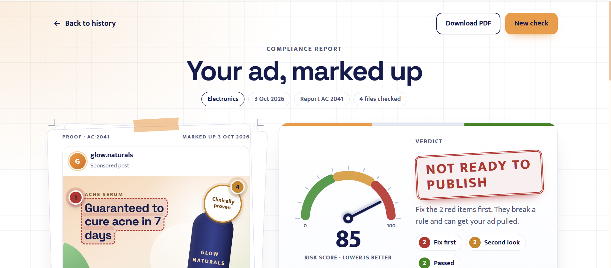
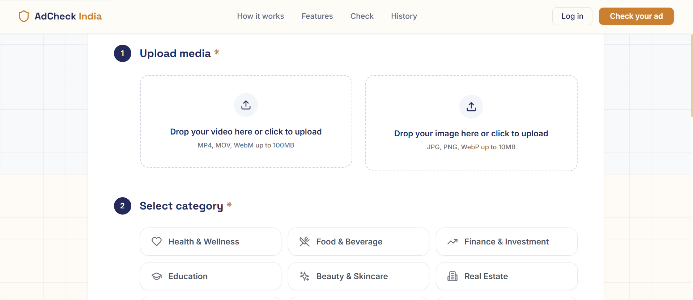
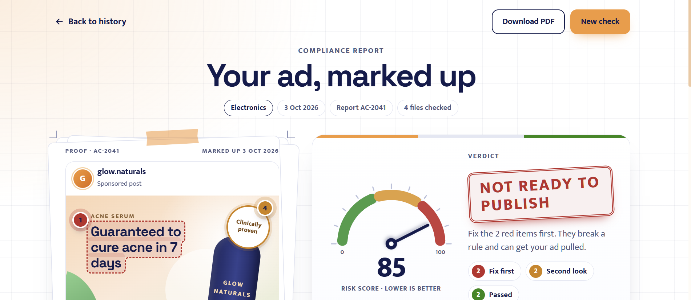
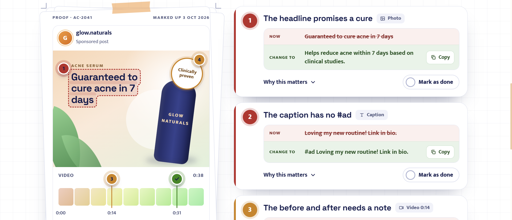
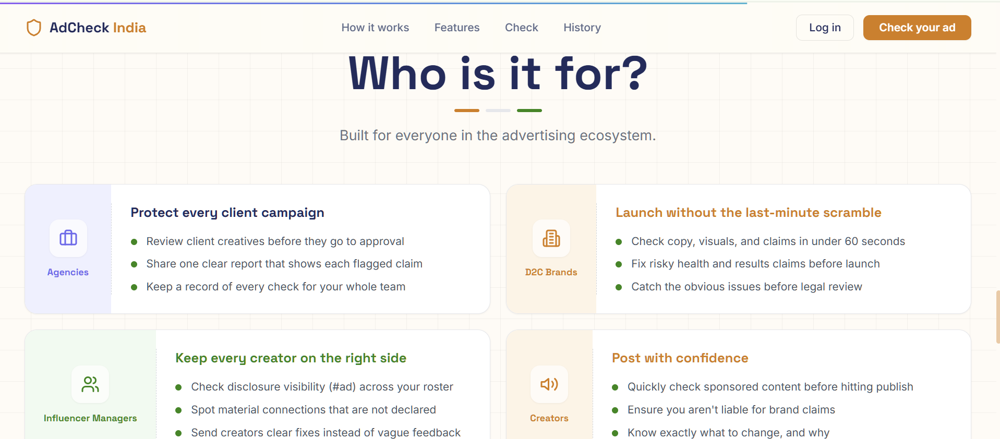

# 🛡️ AdCheck India

> **Check your ad before regulators do.**  
> An AI-powered advertising compliance platform tailored for Indian regulations (ASCI, CCPA, FSSAI, SEBI).



AdCheck India helps Agencies, D2C Brands, Creators, and Influencer Managers instantly analyze their creatives (Images and Videos) to catch risky claims, missing disclosures, and misleading visual demonstrations before they go live.

---

## ✨ Features

- **📸 Multi-modal AI Extraction:** Uses **Llama-3.2-Vision** to extract text, visual demonstrations, product claims, and disclosures directly from images and video frames.
- **🎬 Video Frame Analysis:** Automatically samples keyframes from uploaded MP4/MOV videos using OpenCV, building a chronological timeline of compliance issues.
- **📚 RAG-powered Rules Engine:** Uses a localized **ChromaDB** vector database with `sentence-transformers` to dynamically retrieve the most relevant ASCI and CCPA guidelines based on the ad's content.
- **🧠 Expert Compliance Grading:** Leverages **Llama-3.3-70b** to act as a strict compliance officer, scoring the ad, flagging specific rule violations, and suggesting compliant rewrites.
- **🎨 Beautiful Interactive Reports:** A sleek, fully responsive React frontend with interactive risk gauges, visual bounding boxes, category filtering, and one-click "Mark as done" resolutions.

---

## 📸 Screenshots

### 1. Upload & Categorize
Easily drop your video or image and select your industry (Health, Finance, Food, etc.) to apply the correct regulatory lens.


### 2. Instant AI Reports
Get a detailed breakdown of your ad's risk score and verdict (e.g., "NOT READY TO PUBLISH").


### 3. Actionable Fixes
Every flagged issue cites the exact ASCI rule broken, explains why, and offers a compliant "Change to" rewrite.


### 4. Built for the Whole Ecosystem
Whether you are an Agency protecting a client, or an Influencer Manager ensuring `#ad` visibility, AdCheck India has you covered.


---

## 🛠️ Tech Stack

### Frontend
- **Framework:** React 18 + Vite
- **Styling:** Tailwind CSS + Framer Motion (for smooth animations)
- **Icons & UI:** Lucide React, Custom SVG gauges/charts
- **Routing:** React Router v6

### Backend
- **API Framework:** FastAPI (Python)
- **AI Models:** Groq API (Llama-3.2-11b-Vision, Llama-3.3-70b-Versatile)
- **Vector Database:** ChromaDB (Persistent local storage)
- **Embeddings:** `sentence-transformers` (`all-MiniLM-L6-v2`) runs locally
- **Video Processing:** OpenCV (`opencv-python-headless`)

---

## 🚀 Getting Started

### Prerequisites
- Node.js (v18+)
- Python (3.11+)
- A [Groq API Key](https://console.groq.com/keys)

### 1. Backend Setup

```bash
# Navigate to backend
cd backend

# Create virtual environment (optional but recommended)
python -m venv venv
venv\Scripts\activate  # On Windows

# Install dependencies
pip install -r requirements.txt

# Setup environment variables
cp .env.example .env
# Edit .env and add your GROQ_API_KEY

# Start the FastAPI server
uvicorn main:app --reload --port 8000
```
*Note: On the first run, the backend will automatically download the local embedding model (~80MB) and seed the ChromaDB vector database with all ASCI rules.*

### 2. Frontend Setup

Open a new terminal window:

```bash
# Navigate to the project root
cd AdCheckIndia

# Install dependencies
npm install

# Setup environment variables
cp .env.example .env
# Ensure VITE_API_URL=http://localhost:8000 is set

# Start the Vite dev server
npm run dev
```

Visit `http://localhost:5173` in your browser.

---

## 🏗️ Architecture (RAG Pipeline)

AdCheck India uses an advanced 3-step pipeline to ensure high accuracy and minimize hallucinations:

1. **Extraction:** The media is processed. Video is split into frames. Llama Vision extracts raw text, visual context, and implied claims.
2. **Retrieval (RAG):** The extracted claims are vectorized and searched against a local ChromaDB containing current Indian advertising laws.
3. **Analysis:** The raw claims + the officially retrieved rules are sent to a high-parameter LLM (Llama 70b) to generate a strict, highly accurate compliance report.

---

## ⚖️ Disclaimer
*AdCheck India is an AI-powered risk-screening tool and does not constitute official legal advice or ASCI approval. Always consult a legal professional before launching high-risk campaigns.*
